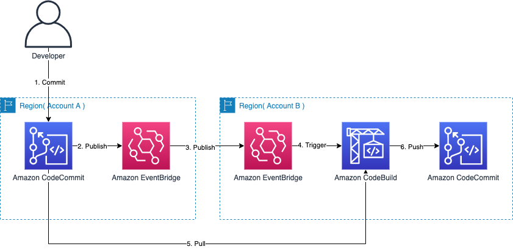

# Croca - Replicate Cross Account Codecommint Repositories

This repository is for replicating codecommit repositories across accounts



> If you are looking for replicating codecommit repositories across regions on same account, check [**Picapica**](https://github.com/haandol/picapica).

# Prerequisites

- Nodejs 14.x
- AWS Account and Locally configured AWS credential

# Installation

Install project dependencies

```bash
$ npm i -g cdk@1.178.0

$ cd infra
$ npm i
$ cdk bootstrap
```

# Usage

This CDK project consists of 2 parts,

- [**OriginStack**](/infra/lib/stacks/origin-stack.ts)
- [**ReplicaStack**](/infra/lib/stacks/replica-stack.ts)

## OriginStack

OriginStack must be `deployed on the origin account` where repositories are placed to which replicate to other accounts

### Setup config

Edit [**lib/interfaces/config.ts**](infra/lib/interfaces/config.ts) and fill variables under `Origin` namespace

```bash
$ vim lib/interfaces/config.ts
```

Here is an full example of the configuration for Origin

```javascript
export namespace Origin {
  export const AccountId = '213809038850'
  export const Region = 'ap-northeast-2'
  export const RoleName = `${App.Namespace}ReplicationRole`
  export const RoleArn = `arn:aws:iam::${AccountId}:role/${RoleName}`

  export const ReplicaAccounts: IReplicaAccount[] = [
    {
      AccountId: '924918149261',
      Region: 'ap-northeast-1',
      EventBusName: App.EventBusName,
    },
    {
      AccountId: '735029250372',
      Region: 'us-west-2',
      EventBusName: App.EventBusName,
    }
  ]
  export const RepositoryNames: string[] = ['myapp', 'otherapp']
  export const BranchNames: string[] = ['main', 'release']
}
```

note that you must put all the {account, region} pairs to be replicated into `ReplicaAccounts`.

here is explaination of above origin setting in plain english,

```
on account **213809038850** in region **ap-northeast-2**,
if modification occurs on repositories, myapp:[main|release] and otherapp:[main|release],
then the events will be propagated to custom event bus on replica accounts, **924918149261** and **735029250372**
```

### Deploy OriginStack on Origin Account

```bash
$ cdk deploy CrocaOriginStack --require-approval never --profile default
```

## ReplicaStack

ReplicaStack should be `deployed on the replica account` where repositories are placed to which are replicated from the origin account

**Note: If you want to deploy ReplicaStack on more than two accounts, you should have a config file for each account**

### Setup config

Edit [**lib/interfaces/config.ts**](infra/lib/interfaces/config.ts) and fill variables under Replica namespace

```bash
$ vim lib/interfaces/config.ts
```

Here is an full example of the configuration for Replica

```javascript
export namespace Replica {
  export const AccountId = '924918149261'   // 12 digit number

  export const Repositories: IRepository[] = [
    {
      RepositoryName: 'myapp',
      BranchName: 'main',
      Region: 'us-west-2',
    },
    {
      RepositoryName: 'otherapp',
      BranchName: 'release',
      Region: 'ap-northeast-2',
    },
  ]
}
```

### Deploy ReplicaStack on Replica Account

As metioned above, you should deploy ReplicaStack on each replica account.

```bash
$ cdk deploy CrocaReplicaStack --require-approval never --profile replica
```

# Test

## On Origin Account

create a codecommit repository

```bash
$ aws codecommit create-repository --repository-name myapp
```

clone repository

```bash
$ pip install git-remote-codecommit
$ git clone codecommit::ap-northeast-2//myapp myapp
```

add README file

```bash
$ cd myapp
$ cat > README.md
# This is MyApp for testing
```

commit and push

```bash
$ git add README.md
$ git commit -m "add README"
$ git push
```

## On Replica Account

Visit [**CodeBuild**] and check it is executed.

# Cleanup

destroy provisioned cloud resources for both accounts

```bash
$ cdk destroy "*"
```
